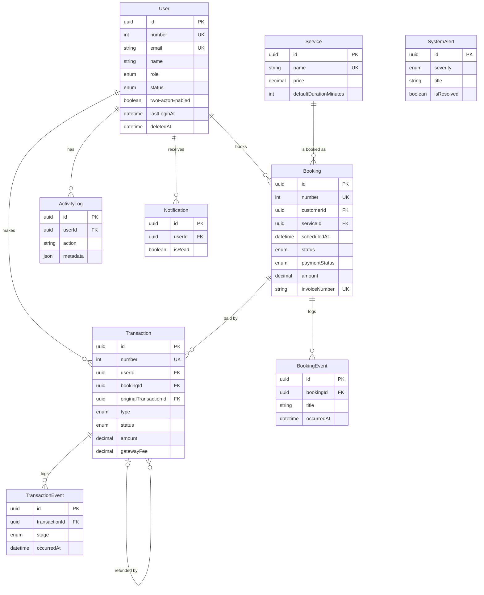

# AdminHub ER Diagram

## Relationship notes

- **User** is both the admin who logs in (SUPER_ADMIN / ADMIN) and the managed application user (EDITOR / VIEWER). Soft delete via `deletedAt`.
- **Transaction** optionally links to a **Booking**. A refund is a new Transaction row with a negative amount whose `originalTransactionId` points at the original.
- **TransactionEvent** and **BookingEvent** are append-only timelines shown on the detail screens.
- **SystemAlert** is standalone; the dashboard also computes alerts live from data (e.g. pending transaction count).
- Users and Services use `Restrict` on delete so financial history is never orphaned.
